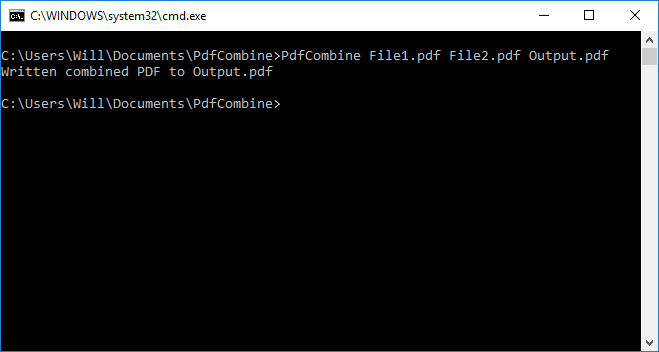

# PdfCombine
A command-line utility to combine multiple PDF files into a single PDF. Uses iText 5 to read and create PDFs.

## Usage
`PdfCombine inputFile1 inputFile2 [inputFiles...] outputFile`

PDFs are combined in the order they are provided.
